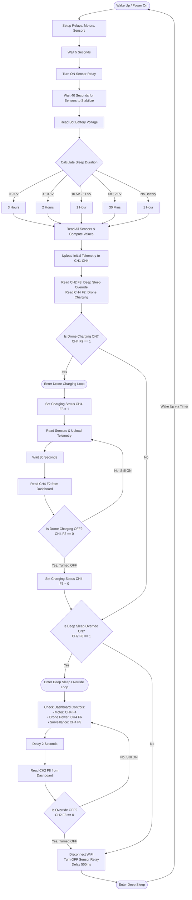

Slothbot-W

```mermaid
flowchart TD
    Start([Wake Up / Power On]) --> InitHardware[Setup Relays, Motors, Sensors]
    InitHardware --> Wait5s[Wait 5 Seconds]
    Wait5s --> SensorRelayOn[Turn ON Sensor Relay]
    
    %% 40-SECOND WAIT
    SensorRelayOn --> Wait40s[Wait 40 Seconds for Sensors to Stabilize]
    Wait40s --> ReadBatt[Read Bot Battery Voltage]
    
    %% DEEP SLEEP CALCULATION
    ReadBatt --> CalculateSleep{Calculate Sleep Duration}
    CalculateSleep -->|< 9.0V| Sleep3h[3 Hours]
    CalculateSleep -->|< 10.5V| Sleep2h[2 Hours]
    CalculateSleep -->|10.5V - 11.9V| Sleep1h[1 Hour]
    CalculateSleep -->|>= 12.0V| Sleep30m[30 Mins]
    CalculateSleep -->|No Battery| SleepDefault[1 Hour]
    
    Sleep3h --> ReadSensors
    Sleep2h --> ReadSensors
    Sleep1h --> ReadSensors
    Sleep30m --> ReadSensors
    SleepDefault --> ReadSensors
    
    %% SENSOR READING & INITIAL UPLOAD
    ReadSensors[Read All Sensors & Compute Values] --> InitialUpload[Upload Initial Telemetry to CH1-CH4]
    
    %% READ TOGGLES
    InitialUpload --> ReadToggles[Read CH2 F8: Deep Sleep Override<br/>Read CH4 F2: Drone Charging]
    
    %% 1. DRONE CHARGING LOOP
    ReadToggles --> CheckCharging{Is Drone Charging ON?<br/>CH4 F2 == 1}
    
    CheckCharging -->|Yes| ChargingLoopStart([Enter Drone Charging Loop])
    ChargingLoopStart --> UpdateF3_On[Set Charging Status CH4 F3 = 1]
    
    UpdateF3_On --> UploadTelemetry30s[Read Sensors & Upload Telemetry]
    UploadTelemetry30s --> Wait30s[Wait 30 Seconds]
    
    Wait30s --> ReadChargeToggle[Read CH4 F2 from Dashboard]
    ReadChargeToggle --> CheckChargingLoop{Is Drone Charging OFF?<br/>CH4 F2 == 0}
    
    CheckChargingLoop -->|No, Still ON| UploadTelemetry30s
    CheckChargingLoop -->|Yes, Turned OFF| UpdateF3_Off[Set Charging Status CH4 F3 = 0]
    
    %% 2. DEEP SLEEP OVERRIDE LOOP
    UpdateF3_Off --> CheckManual
    CheckCharging -->|No| CheckManual{Is Deep Sleep Override ON?<br/>CH2 F8 == 1}
    
    CheckManual -->|Yes| ManualLoopStart([Enter Deep Sleep Override Loop])
    ManualLoopStart --> PollControls[Check Dashboard Controls:<br/>• Motor: CH4 F4<br/>• Drone Power: CH4 F6<br/>• Surveillance: CH4 F5]
    
    PollControls --> Wait2s[Delay 2 Seconds]
    Wait2s --> ReadManualToggle[Read CH2 F8 from Dashboard]
    
    ReadManualToggle --> CheckManualLoop{Is Override OFF?<br/>CH2 F8 == 0}
    
    CheckManualLoop -->|No, Still ON| PollControls
    CheckManualLoop -->|Yes, Turned OFF| DeepSleepSequence
    
    %% DEEP SLEEP SEQUENCE
    CheckManual -->|No| DeepSleepSequence
    DeepSleepSequence[Disconnect WiFi<br/>Turn OFF Sensor Relay<br/>Delay 500ms] --> SleepNow([Enter Deep Sleep])
    
    SleepNow -->|Wake Up via Timer| Start
```
